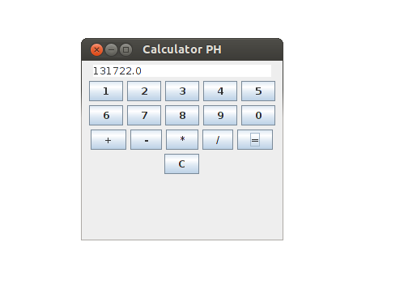

<div align="center">

# Simple Java Calculator


---

This calculator is **simple** with an **easy to use code** to help novices **learn how to create a calculator** program with **`Java`**.

---

</div>

This project was **originally written using `Eclipse`**, but I have **migrated it to NetBeans**.

If you use the executable "SimpleJavaCalculator.jar" file and that doesn't work, you can type this in your terminal:

```shell
java -jar /your_calculator_directory/SimpleJavaCalculator.jar`
```

## :sparkles: Example



## You might also like :monocle_face:

**[My Simple Java Text Editor](https://github.com/pH-7/Simple-Java-Text-Editor).**

[](https://github.com/pH-7/Simple-Java-Text-Editor "Open-Source Simple Java Text Editor")


## 💡 Authors

### Base Application

- **[Pierre-Henry Soria](https://ph7.me)**

### Modifications and Improvements

- [Achintha Gunasekara](http://www.achinthagunasekara.com)
- [xdvrx1](https://github.com/xdvrx1)


## 📮 Contact

Pierre-Henry Soria: pierrehs [AT] hotmail [D0T] com

Achintha Gunasekara: contact [AT] achinthagunasekara [D0T] com


## ⚖️ License

Apache License, Version 2.0 or later; Read **[license.txt](./license.txt)** for further details.
